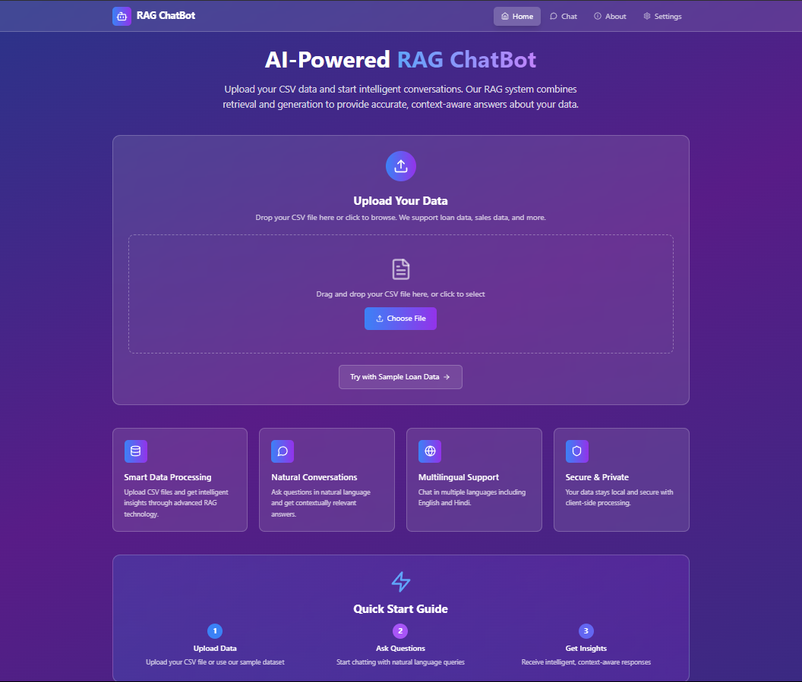

# 💬 RAG Q&A Chatbot - Loan Assistant

A **Retrieval-Augmented Generation (RAG)** chatbot that can answer questions about loan approval data using document retrieval + generative AI. Upload your own CSVs or use the default dataset to get insights using models like GPT-3.5, Flan-T5, or Gemini.

---

## 🚀 Features

- 📂 Upload your own **CSV file**
- 🔍 Intelligent Q&A from documents using **FAISS/Chroma + Embeddings**
- 🧠 Model response from:
  - OpenAI GPT-3.5 / GPT-4 (if credits available)
  - Hugging Face models (Flan-T5, DistilGPT2)
  - Gemini / Claude (optional APIs)
- 💬 Chat interface with:
  - Multilingual support (English, Hindi 🇮🇳)
  - Feedback buttons 👍👎
  - Download chat history
- 🖥️ Multi-page Flask Web App

---

## 📸 Screenshots

### 🏠 Home / Upload Page

### 💬 Chat Interface

### 📘 About Page

---
